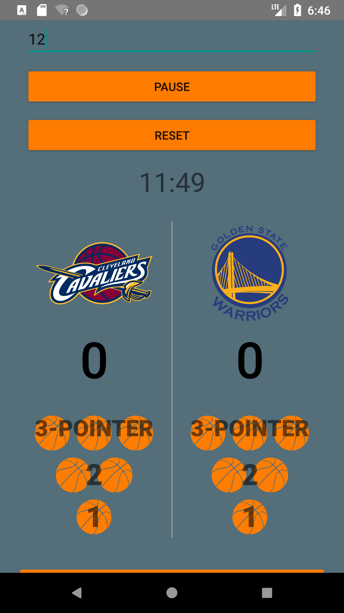
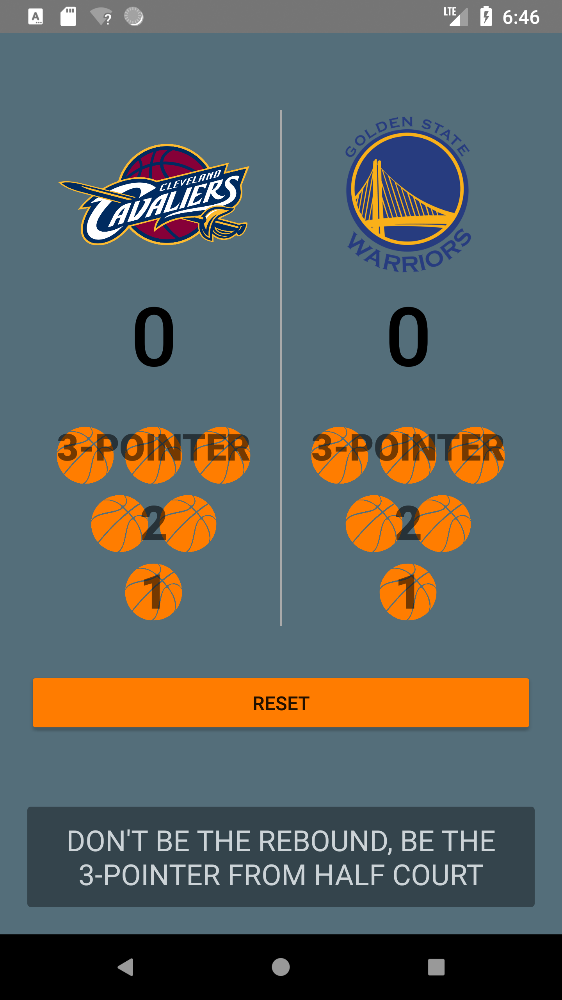
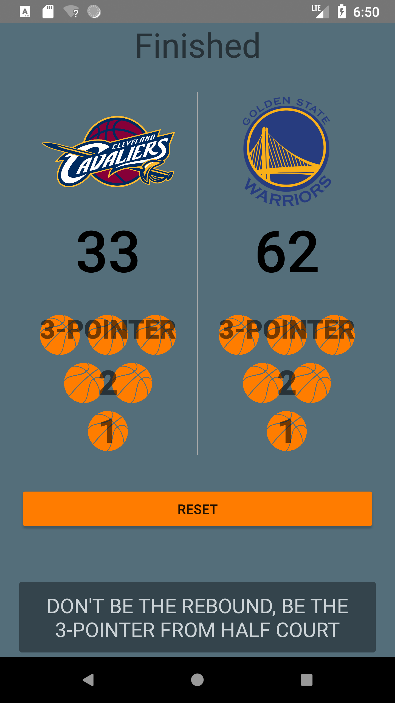
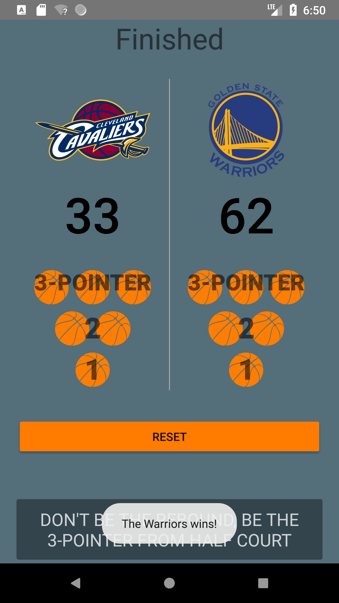

<h1> Court Counter </h1>

<h4> Designed and implemented an interactive app that gives a user 
the ability to keep track of the score of two different teams (Cavaliers vs. Warriors) playing basketball </h4>

The app allows a user to enter a countdown timer in minutes and keep track of the scores for the Cavaliers and the Warriors.
Once the time is up, a toast message appears to announce the appropriate winner.

### Contributing

I would love for you to help make the skeleton more awesome. There are three ways to contribute:

1. Ask for a bug fix or enhancement!
2. Submit a pull request for a bug fix or enhancement!
3. Code review an open pull request!

Be prepared to give and receive specific, actionable, and kind feedback!
